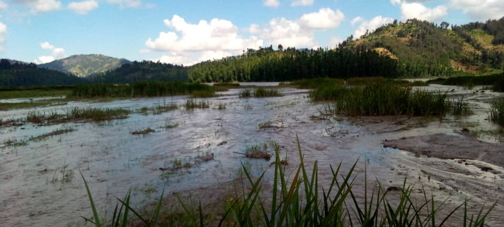

#Biodiversity Nexus Rwanda

## Table of Contents
* Introduction
* Mission and Vision
* Get Involved
* Contact Information
* Follow Us
* nIntroduction
* Welcome to Biodiversity Nexus Rwanda, where we are dedicated to empowering the youth of Rwanda in meaningful conservation activities. Our mission is to foster a deep connection to nature and a commitment to preserving the country's rich biodiversity. Together, we work towards a vision of a Rwanda where biodiversity thrives, wildlife is protected, and future generations are dedicated stewards of the environment.

* Youth in Conservation

## Mission and Vision
## Mission
Our mission is to empower and engage the youth of Rwanda in meaningful conservation activities, fostering a deep connection to nature and a commitment to preserving the country's rich biodiversity.

## Vision
Our vision is a Rwanda where biodiversity thrives, wildlife is protected, and future generations are dedicated stewards of the environment, ensuring a sustainable and harmonious coexistence between people and nature.

# Get Involved
* Join us in our conservation efforts. Here are some ways to get involved:

* Explore our Projects to learn about ongoing initiatives.
* Attend our Events to connect with like-minded individuals.
* Browse our Gallery to see the beauty of Rwanda's biodiversity.
* Read Testimonials from our participants and partners.
* Support our cause by Donating.
* Collaborate with our Partners in conservation efforts.
* Reach out to us through Contact for inquiries and collaboration opportunities.
## Get Involved

* Contact Information
* Feel free to contact us for any inquiries or collaboration opportunities:

* ![Email: info@biodiversityrwanda.org]
* Phone: +250780784924
* Address: Nyarugenge, Kigali, Rwanda
* Follow Us
* Stay updated and connected with us through social media:

* Facebook
* Twitter
* Instagram
* Thank you for your interest in Biodiversity Nexus Rwanda. Together, we can make a positive impact on the * conservation of Rwanda's biodiversity.
